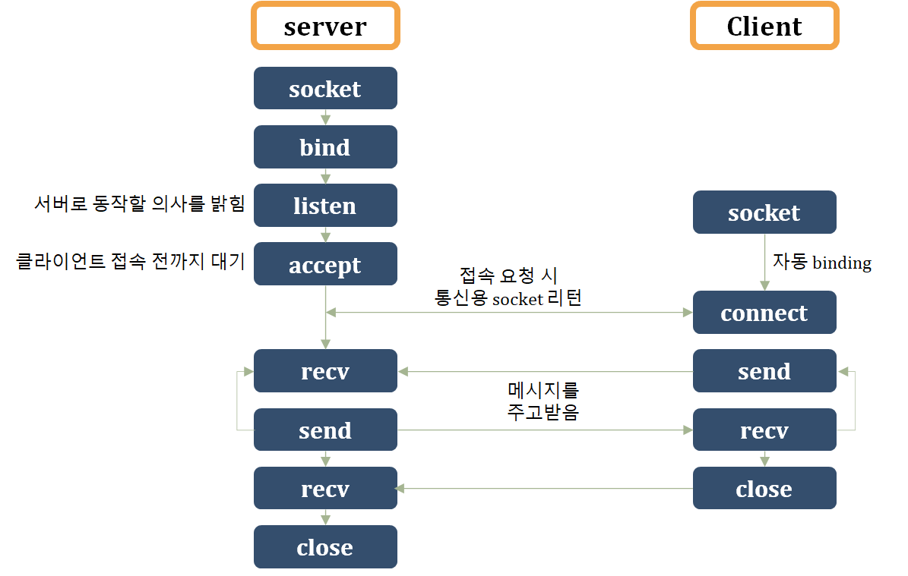

# Thread

[[실습파일]](https://github.com/hongjy127/TIL/tree/master/python/network_programming/thread_ex)

- process: CPU가 배정받는 단위
- program: 여러개의 process
- multi tasking: multi process, multi thread


## Thread

- main thread (메인 스레드)

  - 현재 프로그램을 시작할 때 운영체제에 의해 자동으로 만들어짐
  - 더이상 코드가 없는 경우 종료
  - 프로세스 종료
    - Python, Java: 모든 스레드가 종료했을 때
    - C, C++: 메인 스레드가 종료했을 때
  - 딱 1개 있음

- work thread (작업 스레드)

  

### threading module (파이썬 표준 모듈)

- **Thread class에 함수를 전달**하여 실행
- Thread 기동: **start()**

```python
import threading
# from threading import Thread	# 주로 사용

t = threading.Thread(target=func, args=(,))	# args는 tuple
t.start()	# 반드시 실행해줘야함
```


- Thread를 상속받은 자식 class에 재정의, **run() 메서드 구현**
- Thread 기동: **start()**

```python
from threading import Thread

class WorkerThread(Thread):	# Thread 상속
    def __init__(self):
        super().__init__()	# 속성 초기화
        
    def run(self):
        # 워커 스레드 작업 정의
        pass
    
t = WorkerThread()
t.start()
```


- Thread class 동기화

```python
from threading import Lock

Lock().acquire()	# 한 스레드만 락을 소유, 나머지는 대기
Lock().release()	# 락 해제
```


공유자원: 싱글 스레드끼리 공유하는 거

스레드끼리 영향을 미치거나, 충돌이 일어날 때 lock을 걸어줌

Critical Section(임계영역): lock을 걸어준 영역, 어디를 걸어야할지 잘 판단


- requests 모듈 (`$ pip install requests`) : 인터넷으로 파일 다운

```python
response = requests.get(url)	# url을 요청하고 응답(response)을 리턴
response.text		# 텍스트 저장
response.content	# 실제 데이터 저장
```


# Network Programming

[[실습파일]](https://github.com/hongjy127/TIL/tree/master/python/network_programming/network_ex)

- host

127.0.0.1 : 자기 자신의 컴퓨터

- port

웹서버: 80, ftp: 21 -> well known port number 

0~1024: 표준 통신 프로토콜로 예약됨 (사용하지 않음)


## TCP 통신절차

- TCP : 인터넷을 사용할 때 표준으로 쓰는 프로토콜
- socket : 서버에 연결되려면 채널 필요 (통신용과 다름)
- binding : 주소와 포트번호를 연결



### 기본 코드

- 기본 코드에서 변화가 일어나는 부분, 중복되는 부분들을 함수, 클래스화하여 사용

```python
# server

import socket

HOST =
PORT = 

# socket
# defualt 값으로 server_socket = socket.socket()와 동일
server_socket = socket.socket(socket.AF_INET, socket.SOCK_STREAM)

# 이미 열린 포트 충돌 시 재사용 옵션 설정
server_socket.setsockopt(socket.SOL_SOCKET, socket.SO_REUSEADDR,1)

# bind
server_socket.bind((HOST, PORT))	# (HOST, PORT) tuple

# listen
server_socket.listen()

# accept
client_socket, addr = server_socket.accept()	# 통신용 소켓 리턴

# recv
# 받은 데이터는 decode
data = client_socket.recv(buffer의 길이)	# 데이터가 없으면 대기상태

# send
# .send 보다는 .sendall이 좋음 (sendall에는 flush가 포함)
client_socket.sendall(data)

# close
client_socket.close()
server_socket.close()
```

```python
# client

import socket

HOST = 서버의 주소
POST = 서버의 포트

# socket
client_socket = socket.socket(socket.AF_INET, socket.SOCK_STREAM)

# connect
client_socket.connect((HOST, PORT))

# send
# 보내는 데이터는 encode
client_socket.sendall('안녕'.encode())	# 문자열로 보냄

# recv
# 받은 데이터는 decode
data = client_socket.recv(1024)
data.decode()

client_socket.close()
```


## json (javascript object notation)

파일 전송 프로그램

- stream 형식으로 파일을 보내면 구분을 할 수 없음 -> dict로 만들어서 그대로 보냄

```python
import json

msg = json.dumps(dic)   # 문자열로 dict를 보냄

dic2 = json.loads(msg) 	# 문자열 --> 사전 객체로 복원
```


# MQTT

[[실습파일]](https://github.com/hongjy127/TIL/tree/master/python/network_programming/MQTT_ex)

- IoT 국제 표준

- Broker(MQTT)를 서버로 운영
  - Publisher(sensor)는 Broker에게 메세지를 보냄

  - Subscriber는 Broker에게 관심데이털르 등록, 가장 최근 데이터를 받음.

    


## Eclipse Mosquitto 설치

[Eclipse Mosquitto](https://mosquitto.org/) 설치 > 서비스 > Mosquitto Broker > 시작

C:\Program Files\Mosquitto\mosquitto.conf > 아래 두 줄 추가

```
bind_address 0.0.0.0
allow_anonymous true
```

고급보안이 포함된 방화벽 > 인바운드 > 새규칙 > 프로그램 > mosquitto.exe > 이름은 아무거나

고급설정 > 환경변수 > 시스템변수의 path > mosquitto 경로 추가(C:\Program Files\Mosquitto)


```
-v: 토픽 구독
-h: host
-t: topic
-m: message
#: 다 포함
ex) home/#
+: 한 레벨만 포함
ex) home/+/temp1


// cmd
mosquitto_pub -h localhost -t home/temp -m 12

mosquitto_sub -v -h localhost -t home/temp
```


## paho

- MQTT Python Client

```
pip install paho-mqtt
```


### 기본코드

- pub

```python
import paho.mqtt.client as mqtt

# 1. 클라이언트 클래스 인스턴스화
client = mqtt.Client()
mqttc = mqtt.Client(client_id="", clean_session=True, userdata=None, protocol=MQTTv311,\
       transport='tcp')	

# 2. 브로커 연결
# host만 지정
client.connect("localhost")
connect(host, port=1883, keepalive=60, bind_address="")

# 3. 토픽 메세지 발행
client.publish(topic, payload)
# payload: 전송할 메세지 (주로 문자열)
```

- sub

```python
# 1. MQTT 클라이언트 객체 인스턴스화
client = mqtt.Client()

# 2. 관련 이벤트에 대한 콜백 함수 등록
client.on_connect = on_connect
client.on_message = on_message

# on_connect는 호출하지 않았지만 알아서 실행됨
try:
    # 3. 브로커 연결
    client.connect("localhost")	# 연결 선공시 on_connect에 의해 토픽 구독 신청

    # 4. 메세지 루프 - 이벤트 발생시 해당 콜백 함수 호출됨
    client.loop_forever()
    # client.loop_start()     # 데몬스레드
except Exception as e:
    print(f"에러 {e}")
```


```python
# 네트워크 루프
# pub 사용
loop()
# sub 사용
loop_start()	# 새로운 스레드 생성, 메인 스레드가 종료할 때 함께 종료
loop_forever()	# 현재 스레드로 호출, 다른 작업은 할 수 없음

# callback
# 관례로 on이 붙음
on_connect(client, userdata, flags, rc)
# connect를 실행 -> on_connect 메서드 호출 -> rc를 보고 판단 -> 후속작업
on_disconnect(client, userdata, rc)
on_message(client, userdata, message)
```

