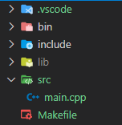

# C++

## 개발환경

- **vscode**

  업데이트 방지: 설정 > update 검색 > update mode:none

  다시 설치: 1.52 버전

  확장팩 >  c/c++, easy c++ projects


- **컴파일러**

  [GCC 컴파일러 설치]([MinGW-w64 - for 32 and 64 bit Windows - Browse /mingw-w64 at SourceForge.net](https://sourceforge.net/projects/mingw-w64/files/mingw-w64/))

  Architecture: x86_64

  PATH 환경변수

  - 내PC > 속성 > 고급시스템설정 > 환경변수 > path > 추가

    C:\Program Files\mingw-w64\x86_64-8.1.0-posix-seh-rt_v6-rev0\mingw64\bin

  - make

    C:\Program Files\mingw-w64\x86_64-8.1.0-posix-seh-rt_v6-rev0\mingw64\bin에서

    mingw32-make.exe 복사 > make.exe로 바꾸기

    vscode에서 bin\main 으로 실행


## 프로젝트 만들기

F1 > create new c++ project > [G++/GDB] Linux 선택



클래스 만들기: F1 > create new class > 클래스 유형 선택


- 헤더 파일
  - 멤버 변수, 멤버 함수의 원형 정의
- cpp
  - 헤더 파일을 include
  - 멤버함수 구현


## 인터프리터 / 컴파일 언어

| 인터프리터 언어                                        | 컴파일 언어                                              |
| ------------------------------------------------------ | -------------------------------------------------------- |
| Python, JS 등                                          | C++ 등                                                   |
| python.exe가 실행 (번역할때마다 파일을 읽음, 동시번역) | 컴파일러가 소스에서 .exe 파일을 만듦.                    |
| 파일을 그대로 사용 가능                                | 환경(운영체제, os, cpu)가 달라지면 다시 컴파일을 해야함. |
| type변경 가능                                          | type 고정                                                |
| machine 독립적                                         | machine dependent                                        |
| 속도가 상대적으로 느림.                                | 속도가 상대적으로 빠름.                                  |


## 문법

- 프로그램 기본 구조

```c++
#include <iostream>
using namespace std;

int main(int argc, char const *argv[])
{ 
    return 0;
}
```


### 변수와 자료형

- 변수

  - 선언하고 사용

  - 식별자(변수, 상수, 함수명 등)는 사용하기 전 반드시 선언

    ```c++
    // 데이터타입 변수명 [=초기값];
    int i;
    i = 100;
    
    int i = 100;
    int i {100};
    ```

- 기본 자료형

  | 자료형       |        | 바이트 수 |
  | ------------ | ------ | --------- |
  | 정수형       | byte   | 1         |
  |              | short  | 2         |
  |              | int    | 4         |
  | 문자형       | char   | 1         |
  | 부울형       | bool   | 1         |
  | 부동소수점형 | float  | 4         |
  |              | double | 8         |

  - boolean
    - true: 0이 아닌 모든 값, 일반적으로 1
    - false: 0
  - char
    - ' '로 묶어서 표현(" " 아님)
    - 글자 하나 저장

  - string

    - 문자열을 저장하는 데이터 타입(객체)

    - `#include <string>`을 먼저 지정 후 사용

  | 멤버함수           | 설명                                              |
  | ------------------ | ------------------------------------------------- |
  | s[i]               | i번째 원소                                        |
  | s.empty()          | 비어있으면 true                                   |
  | s.insert(pos, s2)  | s의 pos에 s2 삽입                                 |
  | s.remove(pos, len) | s의 pos에 len만큼 삭제                            |
  | s.find(s2)         | s에서 s2가 발견되는 첫번째 인덱스, 없으면 -1 반환 |
  | s.find(pos, s2)    | pos위치부터 s2가 발견되는 첫번쨰 인덱스           |
  | s.size()           | 문자열 길이                                       |

  

  - const
    - 수정 불가
    - 관례상 대문자로 이름 지정
  - auto
    - 자동으로 데이터 타입을 결정


### 배열

- **같은 종류**의 데이터를 **순차적**으로 저장

- 배열 변수는 배열의 시작 주소를 나타내며 상수

  - `score = 100` 이런 연산 불가능(score가 배열일 때)

  ```c++
  // dtype 배열의 이름[배열의 크기];
  int score[10];
  int arr[3] = {1,2,3};
  int arr[3] {1,2,3};
  ```

  

### 입력과 출력

- cin

  - 화이트문자로 구분
  - getline: 엔터 전까지 모든 문자열을 하나로 봄

  ```c++
  cout << 출력할 값;
  cout << 출력할 값 << endl;
  cout << 출력할 값1 << 출력할 값2;
  ```

- cout

  - 자동 형 변환

  ```c++
  cin >> 입력할 값;
  ```


### 연산자

- +, -, *, /, %
- 1/2 = 0.5(python), 0(c++)

- ++, --


### 제어구조

#### 관계 연산자

- ==, !=, >, <, >=, <=

#### 논리연산자

- &&(AND), ||(OR), !(NOT)

#### if

- if~else 문

  ```c++
  if(조건){
      코드블럭;
  }
  else{
      코드블럭;
  }
  ```

  ```c++
  if(조건){
      코드블럭;
  }
  else if{
      코드블럭;
  }
  else{
      코드블럭;
  }
  ```

#### switch

- switch 문

  ```c++
  switch(변수){
      case 0:
          코드블럭;
          break;
          ...
  }
  ```

#### while

- while 문

  ```c++
  while(조건식){
      코드블럭;
  }
  ```

- do~while 문

  ```c++
  // 잘 안씀.
  do{
      코드블럭;
  }while(조건식);
  ```

#### for

- for 문

  ```c++
  for(초기식;조건식;증감식){
      코드블럭;
  }
  ```

  ```c++
  for(변수:범위-배열){
      코드블럭;
  }
  ```

  

### 함수

- 위치기반만 지원(키워드 기반 x)
- 함수가 뒤에 있으면 함수 원형(signature) 선언 필요
- 매개변수가 없으면 (void), return type도 void 가능
- overload(중복함수) : 함수의 이름은 동일하지만 인자가 다르면 다른 함수로 인식

```c++
반환형 함수이름(타입 매개변수){
    문장들;
}
```

#### 람다함수

```c++
[](매개변수)->리턴타입{함수내용}
```


#### 함수 인자 전달방법

- call by value
  - 복사본, 원본에 영향을 안줌.
- call by reference
  - 원본에 영향
  - python의 call by reference 아님
  - 함수의 매개변수에 &(이름을 하나 더 배정)
- call by address(pointer)
  - 원본에 영향
  - python의 call by reference와 동일


### 클래스

```c++
class 클래스이름{
접근지정자:
// public: 어디서나 접근 가능
// protected: 클래스 안과 상속된 클래스에서 접근 가능
// private(default): 클래스 안에서만 접근 가능
    자료형 멤버변수;
    
    반환형 멤버함수();
};
```

- 객체 생성

  ```c++
  // 객체명 변수명;
  Circle obj;
  // stack에 생성(정적 생성), 함수가 끝나면 사라짐.
  
  obj = newCircle();
  // heap에 생성(동적 생성)
  // GC가 없고 개발자가 직접 삭제
  // delete obj
  ```

- 객체 멤버 접근

  ```c++
  obj.radius = 3;
  obj.calcArea();
  ```


#### 상속

- `class 자식클래스명 : 부모클래스명 { }`

- 생성자, 소멸자

  - 부모클래스 생성자 -> 자식클래스 생성자

    `자식클래스 생성자() : 부모클래스 생성자(), 멤버변수 초기화 리스트...`

  - 자식클래스 소멸자 -> 부모클래스 소멸자

    - 파괴자는 하나라 따로 상속 안함

- 오버라이드
  - 부모 클래스의 멤버 함수와 원형이 동일
  - 부모 클래스 호출 `부모클래스::함수명()`
- 다중상속


### 생성자와 접근 제한자

#### 생성자(constructor)

- 객체가 인스턴스화 될 때 딱 한 번 자동으로 호출되는 멤버함수
- 리턴타입 없음.
- 멤버 변수 초기화 목적
- 클래스 이름과 동일
- 생성자를 정의하지 않으면 티폴트 생성자 자동 추가(매개변수 없음)
- 오버로드 가능

#### 소멸자(destructor)

- 인스턴스 변수가 메모리에서 사라질 때 자동으로 호출
  - 전역변수: 프로그램 종료 시
  - 지역변수: 블럭이 끝날 때
  - 동적 생성 변수: delete 호출
- ~클래스명()
- 매개변수 없음
- 오버로드 불가능(1개만 존재)


### 객체 배열

```c++
// 클래스명 배열의 이름[배열의 크기];
Circle objArray[3];
```


### 벡터

- 동적으로 크기를 자동으로 조절(Heap)
- 아두이노에서는 사용하지 못함

```c++
#include <vector>

// vector<배열의자료형> 배열의 이름(배열의 크기)
vector<int> scores(10);
```

- `.front()`, `.back()`
- `push_back()`, `pop_back()`
- `v.insert(v.begin()+i,value);` : 중간에 삽입
- `v.erase(v.begin()+i);` : 중간에 삭제


### 포인터와 동적 객체 생성

#### 포인터(pointer)

- 메모리의 주소값을 저장하는 변수
- 데이터는 모두 주소, 크기는 8 byte
- 타입 뒤에 *

```c++
int *p;
double *p;
Circle *p;
```


#### 주소 연산자 &

- 주소 값을 포인터 변수에 저장
- 변수 앞에 &

```c++
int *p = &number;	// 주소값
int &a = number;	// 참조변수
```


#### 간접 참조 연산자 *

- 주소에 저장된 데이터를 얻을 때

```c++
cout << p << endl;	// 주소 출력
cout << &number << endl;	// 주소 출력
cout << *p << endl;	// 값 출력

*p = 20;	// 값 쓰기
p = 20;	// 주소를 20으로 바꿈(p가 주소를 나타낼 때)
```


#### NULL

- int이면서 포인터
- 포인터 변수를 초기화 할 때 (초기화를 안하면 임의의 값이 들어감)
- `nullptr` : 포인터로만 사용


#### 동적 할당 메모리

- 스택(stack)
  - 시스템에 의해 관리
  - 함수 호출 시 지역변수 할당(생성자 호출)
  - 함수 종료 시 지역변수 제거(파괴자 호출)
- 힙(Heap)
  - 개발자에 의해 관리
  - new 호출 시점(생성자 호출)
  - delete 호출 시점(파괴자 호출) - 동적 메모리 회수

- 스마트 포인터
  - `#include <memory>`
  - `unique_ptr`
  - `shared_ptr`


#### 동적 객체 생성

- `포인터변수->멤버`


#### this 포인터

- 자신에 대한 포인터 변수
- 이름충돌이 났을 때 사용
- 우선순위: 지역변수 -> 멤버변수 -> 전역변수
  - 전역변수 호출 `::length = 30;`
  
  - 멤버변수 호출 `this->length`
  
    

#### const 포인터

```c++
const int *p;	// 내용 수정 불가
int * const p;	// 주소 수정 불가
const int * const p;	// 모두 수정 불가
```

