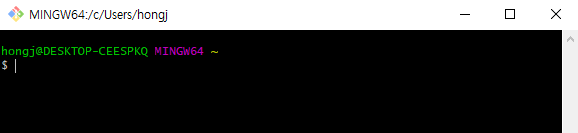

# CLI/vim

> ## Contents
>
> - [CLI](#cli)
> - [vim](#vim)

## CLI

CLI (Command Line Interface) <-> GUI (Graphic User Interface)

터미널로 컴퓨터랑 상호작용하는 것

### CLI 기본 명령어

#### cd
`$ cd ~` : 홈폴더로

`$ cd ..` : 상위폴더로

`$ cd ../..` : 상위폴더의 상위폴더로

###### 참고)

- \이 붙으면 절대경로, 안붙으면 상대경로 (working directory 기준)

  - / : 최상위 폴더
  - ~ : 홈폴더
  - . : 자기자신
  - .. : 상위 디렉토리

#### mkdir
`$ mkdir <dir_name>` : 새로운 directory (폴더) 만들기

#### touch
`$ touch <file_name>` : 새로운 파일 만들기

###### example
`$ touch test.txt`

`$ touch index.html`

#### ls (git에서)

`$ ls` : list, directory파일 목록 확인

`$ ls -a` : 숨겨진 파일까지 확인

#### dir (cmd)

`> dir` : directory 모든 목록 확인

#### rm

`$ rm <file_name>` : 파일 삭제

`$ rm -r <file_name>`

#### mv

`$ git mv <원본 이름> <변경할 이름>`

#### start

`$ start <file_name>` : 파일 열기 # Ctrl + click

## vim

CLI 문서 편집기

| 명령어 | 설명 |  |
| :--------------: | :--------------: | :--------------: |
| i | 편집(insert)모드 |  |
| esc | 명령모드 |  |
|   :w   |       저장       | 명령모드에서 |
|   :q   |       종료       | 명령모드에서 |
|  :wq   |   저장 후 종료   | 명령모드에서 |
|  :q!   |    강제 종료     | 명령모드에서 |