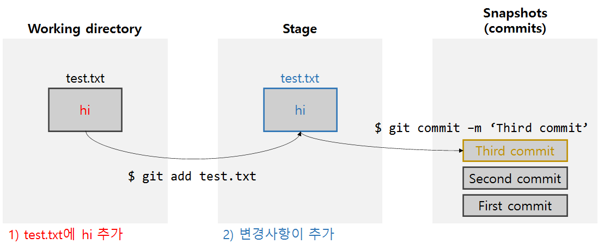

# Git

> Contents
>
> - CLI
> - vim
> - git 명령어

- git 설치 (https://git-scm.com/)
- git book (https://git-scm.com/book/ko/v2)


## CLI

### CLI란?

CLI (Command Line Interface) <-> GUI (Graphic User Interface)

터미널로 컴퓨터랑 상호작용하는 것


###### 참고)
/ : 최상위 폴더
~ : 홈폴더


### CLI 기본 명령어

#### cd
`$ cd ~` : 홈폴더로

`$ cd ..` : 상위폴더로

`$ cd ../..` : 상위폴더의 상위폴더로

#### mkdir
`$ mkdir DIRECTORY_NAME` : 새로운 directory (폴더) 만들기

#### touch FILE_NAME
`$ touch FILE_NAME` : 새로운 파일 만들기

###### example
`$ touch test.txt`
`$ touch index.html`

#### ls
`$ ls` : list, directory파일 목록 확인
`$ ls -a` : 숨겨진 파일까지 확인

#### rm

#### rm -r

#### mv


## vim

CLI 문서 편집기

| 명령어 | 설명 |  |
| :--------------: | :--------------: | :--------------: |
| i | 편집(insert)모드 |  |
| esc | 명령모드 |  |
|   :w   |       저장       | 명령모드에서 |
|   :q   |       종료       | 명령모드에서 |
|  :wq   |   저장 후 종료   | 명령모드에서 |
|  :q!   |    강제 종료     | 명령모드에서 |


## Git

### Git이란?

Version Control System

### git 명령어

#### 처음 설정

`git config --global user.name "이름"`

`git config --global user.email "이메일"`

---

```
$ cd learn_git

$ git init
```

: learn_git 폴더를 repository (repo, 저장소) 로 만듦.
: ls -a 을 실행하면 .git/이 생김.

주의)

`$ git init` 를 home 폴더에 적용하면 안됨.

---

`$ git status ` : 현재 상태 보기

`$ git log` : commits 요약

---

#### add/commit

`git add FILE/DIRECTORY_NAME` : 등록 or tracking

`git add .`  : directory 전체 올리기

`git commit -m 'COMMIT_MESSAGE'` : commit



`git rm --cached FILE/DIRECTORY_NAME`  : tracking 취소

`git restore --staged FILE/DIRECTORY_NAME`  : stage에서 내리기

`git restore FILE/DIRECTORY_NAME` : 복원 (잘 안씀)


