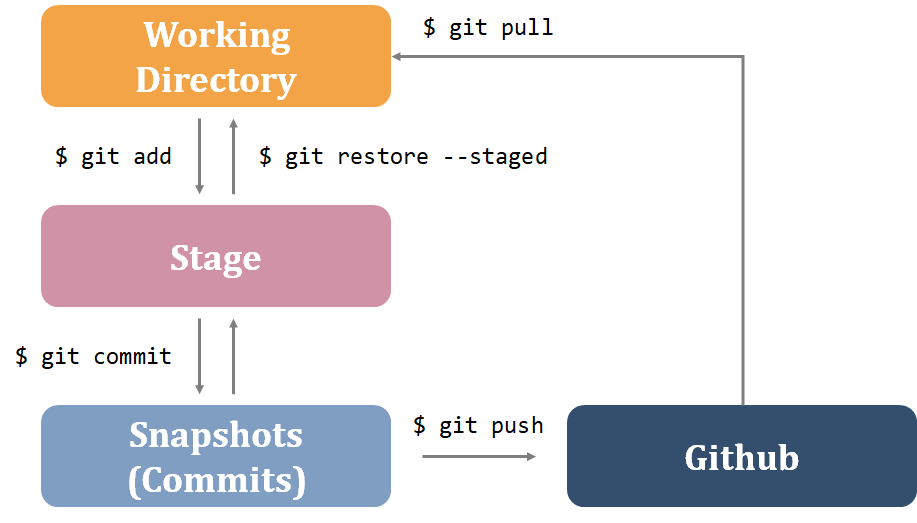

# Git

> ## Contents
>
> - [Settings](#settings)
> - [Git 기본 명령어](#git-기본-명령어)
> - [Git 공부](#Git-공부)

## Git이란?

Version Control System

- [[git 설치]](https://git-scm.com/)

- [[git book]](https://git-scm.com/book/ko/v2)

## Settings

- 컴퓨터마다 한 번씩만 설정하는 것

  `git config --global user.name "이름"`

  `git config --global user.email "이메일"`

- Project 생성 시 설정하는 것

1. `$ mkdir <dir name>`

2. `$ cd <dir name>` 

     `$ git init`

     `$ touch .gitignore` [[gitignore]](https://www.toptal.com/developers/gitignore)

     `$ touch README.md` # 해당 프로젝트의 설명서 / 최상위 폴더에 만들기

## Git 기본 명령어

​	`$ git 명령어 -h` : help

- Github에 백업

1. `$ git init` (로컬 저장소로 만듦) 상태에서

2. `$ git add <dir/file_name>`

3. `$ git commit -m 'COMMIT MESSAGE'`

4. Github에 remote 저장소 만들기 (new repository), 주소 복사

5. `$ git remote add origin <URL>` (등록/한번만 필요)

6. `$ git push origin master`

   **만들어져 있는 경우 2, 3, 6 반복**

- 다운로드

1. `git init` 상태에서

2. `$ git remote add origin <URL>` 로 설정 해준 뒤(Github 주소 복사),

3. `$ git pull origin master` 

   or

​	1. `$ git clone <URL>` : clone으로 받은 ropo는 `$ git init`이 필요하지 않음. (config 설정이 되어있음.)

- Github로 협업하기 (branch)

  - `$ git branch`
  - `$ git branch <branch_name>`
  - `$ git merge <branch>`

- Git 상태 확인
	- `$ git log`
	- `$ git status`

## Git 공부

- repository (repo, 저장소) 만들기

`$ cd <dir name>` : 파일경로에서

`$ git init` : 실행하면 dir를 repo로 만듦.

주의) home 폴더에 적용하면 안됨

`$ ls -a` : 실행하면 .git/이 생김(확인)

- 상태 확인

`$ git status ` : 현재 상태 보기

`$ git log` : commits 요약

​	`$ git log --pretty==oneline -abbrev -commit` : commit 짧게 나옴.

​	`$ git log --pretty=format:"%d%s" --graphs` : commit 그래프 보기

### add/commit

git은 바뀐 내용만 저장

`$ git add <dir/file_name>` : 등록 or tracking

`$ git add .`  : directory 전체 올리기

`$ git commit -m 'COMMIT_MESSAGE'` : commit

`$ git restore --staged <dir/file_name>`  : stage에서 내리기

`$ git restore <dir/file_name>` : 복원 (잘 안씀)

### github에 올리기

`$ git remote add <remote_name> <URL>` : URL을 remote_name(주로 origin)으로 등록 (한 번만 등록)

`$ git remote -v` : 모든 저장소 보여주기

`$ git push <remote_name> <branch>` : remote_name을 push (git hub에 백업됨.)

`$ git rm` : 원격 저장소와 로컬 저장소 파일 삭제

`$ git rm --cached <dir/file_name>`  : 원격 저장소 파일 삭제, 로컬 저장소는 유지

### Branch 만들기

* 코드가 어떤 영향을 줄 지 모를 때 branch 사용해서 해보기

* 협업할 때 branch로 작업 후 github에서 merge
* git flow, github flow

`$ git branch` : branch 목록 보기

`$ git branch <branch_name>` : branch 만들기

`$ git switch <branch>` : branch로 이동 (HEAD -> \<branch>)

`$ git switch -c <branch>` == `$ git checkout -b <branch>` : branch를 만들고 이동까지 같이 하는 것

`$ git chechout <branch/commit_id>` : branch/commit_id 으로 HEAD가 움직임 / commit하지 않고 과거 코드를 보고오는 용으로 사용

`$ git reset` : commit을 없애고 돌아감

참고) `$ git log` 시 나오는 주소(commit_id)는 앞에 6개만 써도 자동완성

`$ git merge <branch>` : master branch로 가서 합쳐야 함. / 합쳐지면 알아서 commit이 생김

`$ git branch -d <branch_name>` : branch 삭제 (merge가 끝난 branch는 삭제하는 것이 좋음.)

`$ git branch -D <branch_name>` : branch 강제 삭제

- 협업할 때

  settings > manage access > invite a collaborator > username > email 승인 > `$ git clone <URL>`

  - sync 맞는지 확인하기 위해 `$ git pull`, `$ git push` 해보기
  - branch를 따고 merge는 꼭 remote 저장소 (github)에서 진행 (conflict 방지)

----

fast forward (no merge commit)

auto merge commit

conflict => manual merge commit

HEAD

