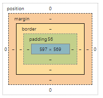

# CSS


## 기본 문법

- 실제로는 외부 스타일  시트를 적용하지만 연습할 때는 내부 스타일 시트로 사용
- 가독성을 위해 보통 속성 항목 하나 당 한줄로 사용
- 적용 우선순위: 인라인>내부>외부 (구체적인게 더 우선)


```css
/* 외부 스타일 시트(.css) */
seletor {
    property1 : value1;
    property2 : value2;
    ...
}

/* 외부 스타일 시트 적용 방법 */
<head>
	<link type="text/css" rel="stylesheet" href="style.css"/>
</head>

/* 내부 스타일 시트(보통 head에) */
<style>
    seletor {
        property1 : value1;
        property2 : value2;
        ...
    }
</style>

/* 인라인 스타일 시트 */
<태그 style="">
```


### 선택자

#### 기본 선택자

```css
* {property : value;}		/* 전체 선택자 */
태그 {property : value;}	/* 타입 선택자 */
.class이름 {property : value;}	/* 클래스 선택자 */
#아이디 {property : value;}	/* 아이디 선택자 */
[속성] {property : value;}	/* 속성 선택자 */
[속성=값] {property : value;}	/* 속성 선택자 */
```


#### 가상 선택자

- 주로 a 태그와 사용

```css
a:link {property : value;}	/* 방문하지 않은 링크 */
a:visit {property : value;}	/* 방문한 링크 */
a:active {property : value;}	/* 선택 순간 */
a:hover {property : value;}	/* 마우스 포인터를 올리는 순간, a태그 말고도 자주 쓰임 */
```

- 표에서 사용 (zebra 효과)

```css
E:nth-child(n)
E:first-child
E:last-child
```


#### 조합 선택자

```css
selectorA selectorB	/* 후손 선택자 */
selectorA > selectorB	/* 자손 선택자 */
```


### 박스 모델

- content
- border
- padding
- margin



- 크기의 단위는 px, cm, % > 최근 스마트폰 때문에 보통 %를 많이 사용

```css
selector {
    margin: top right bottom left;
    margin: top right&left bottom;
    margin: top&bottom right&left;
    margin: top&right&bottom&left;
}
```


### 레이아웃 속성

- float

  정렬 아님, 붙이는 순서대로 배치됨.

